# AWSD
### *Adventurer Who Solves Dungeons*

> Prototipo de robot autónomo para exploración de laberintos interactivos.

---

  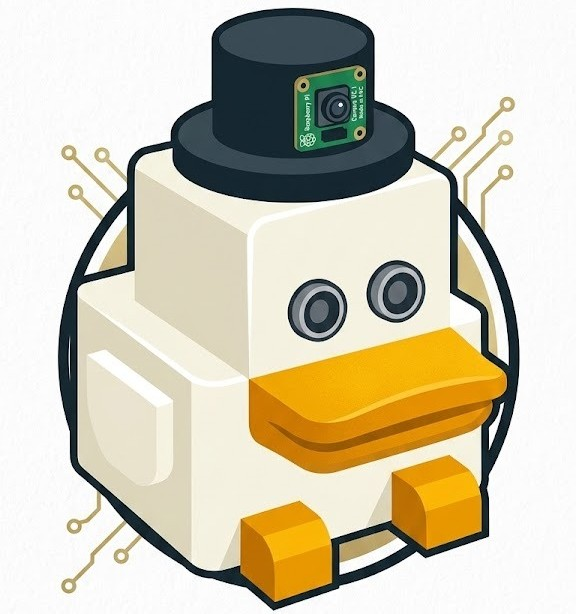

# Descripción

AWSD (*Adventurer Who Solves Dungeons*) es un prototipo de robot autónomo diseñado para explorar laberintos de forma inteligente e interactiva. El proyecto combina robótica, visión artificial e interacción con el usuario para crear una experiencia inspirada en los videojuegos de aventuras.

Gracias a su cámara y a sus algoritmos de reconocimiento visual, el robot es capaz de analizar el entorno y localizar elementos importantes dentro del laberinto, como llaves necesarias para abrir puertas y avanzar en el recorrido.

Durante la exploración, AWSD encuentra distintos retos en forma de preguntas o pruebas que el usuario debe resolver para ayudar al robot a progresar. El objetivo del proyecto es integrar navegación autónoma, inteligencia artificial y gamificación en una experiencia educativa y entretenida.

---

# Foto Robot

  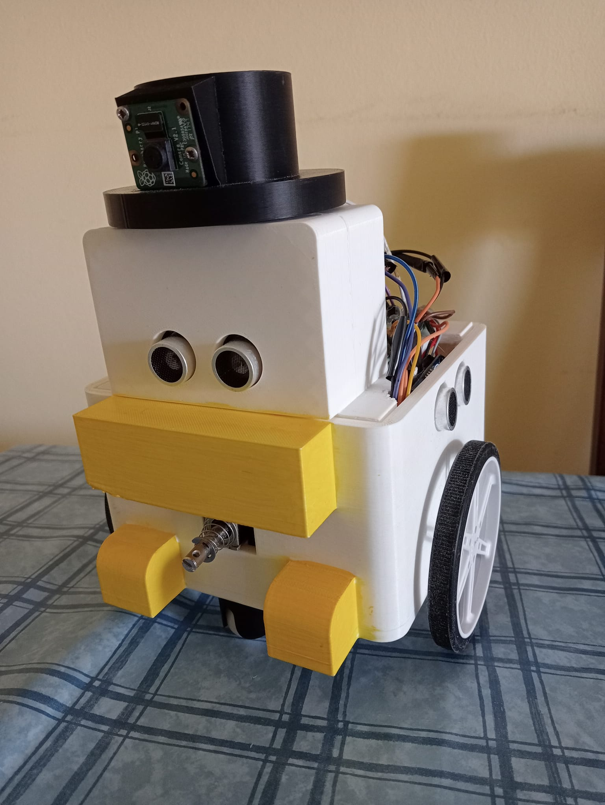

---

# Hardware

| Componente | Imagen | Descripción | Enlace |
|---|---|---|---|
| **Raspberry Pi Zero W** | 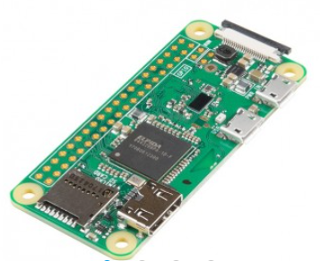 | Cerebro del robot, gestiona la lógica y la conectividad Wifi. | [Ver Tienda](https://tienda.bricogeek.com/placas-raspberry-pi/1082-kit-basico-raspberry-pi-zero-wifi-microsd-32gb.html) |
| **Sensor Ultrasonidos** | 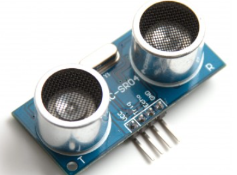 | Mide las distancias para detectar las paredes del laberinto. | [Ver Tienda](https://tienda.bricogeek.com/sensores-distancia/741-sensor-de-distancia-por-ultrasonidos-hc-sr04.html) |
| **Motor N20 (6V 200 RPM)** | 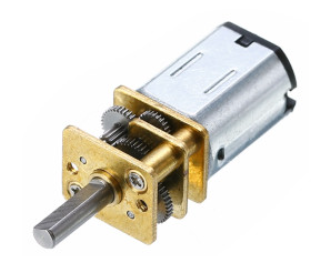 | Motores con reductora metálica para el movimiento del chasis. | [Ver Tienda](https://tienda.bricogeek.com/motores-dc/1835-motor-n20-con-reductora-metalica-6v-200-rpm.html) |
| **Cámara Raspberry Pi v2** | 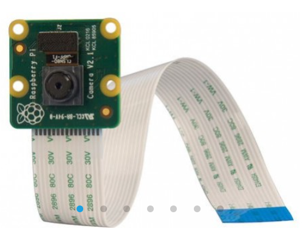 | Captura imágenes en alta definición para la visión artificial. | [Ver Tienda](https://tienda.bricogeek.com/sensores-imagen/822-camara-raspberry-pi-v2-8-megapixels.html) |
| **Solenoide 5V** | 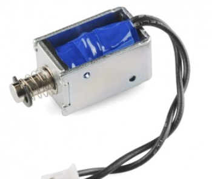 | Actuador lineal para interactuar con los mecanismos del entorno. | [Ver Tienda](https://tienda.bricogeek.com/componentes/430-solenoide-5v.html) |
| **Módulo Relé** | 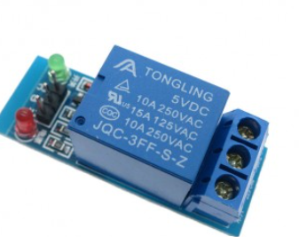 | Permite controlar el encendido del solenoide de forma segura. | [Ver Tienda](https://tienda.bricogeek.com/interruptores/1352-modulo-rele-5v.html) |
| **Controlador TB6612FNG** | 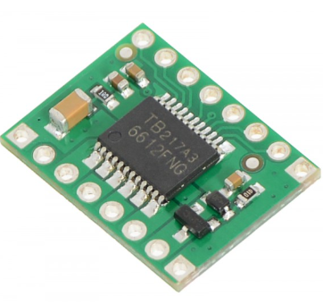 | Driver encargado de gestionar el sentido y velocidad de los motores. | [Ver Tienda](https://tienda.bricogeek.com/controladores-motores/999-controlador-de-motores-tb6612fng.html) |
| **Batería Externa Anker** | 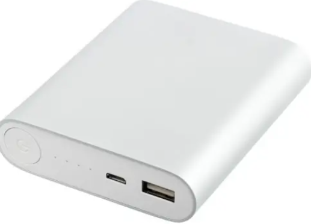 | Powerbank Slim encargada de alimentar la Raspberry Pi. | [Ver Tienda](https://www.amazon.es/Anker-PowerCore-Magnetic-Slim-B2C/dp/B099284SRR/) |
| **Porta Pilas 4xAA** | 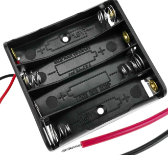 | Soporte de baterías para la alimentación externa de los motores. | [Ver Tienda](https://tienda.bricogeek.com/componentes/160-base-para-baterias-4xaa.html) |
| **Mini Protoboard** | 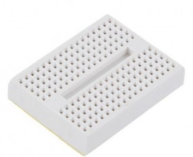 | Placa de pruebas para realizar las conexiones eléctricas. | [Ver Tienda](https://tienda.bricogeek.com/herramientas-de-prototipado/211-mini-breadboard-adhesiva.html) |
| **Ruedas (80x10mm)** | 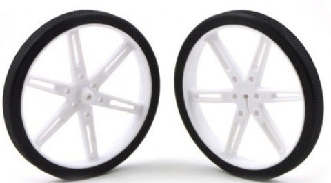 | Pareja de ruedas principales acopladas a los motores N20. | [Ver Tienda](https://tienda.bricogeek.com/robotica/303-pareja-de-ruedas-80x10mm-blanco.html) |
| **Rueda Loca ABS** | 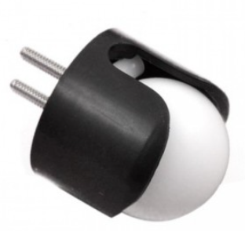 | Punto de apoyo pivotante trasero para dar estabilidad al robot. | [Ver Tienda](https://tienda.bricogeek.com/robotica/995-rueda-loca-plastico-abs-34.html) |

---

# Circuito Eléctrico

Diagrama de conexiones del sistema electrónico del robot.

  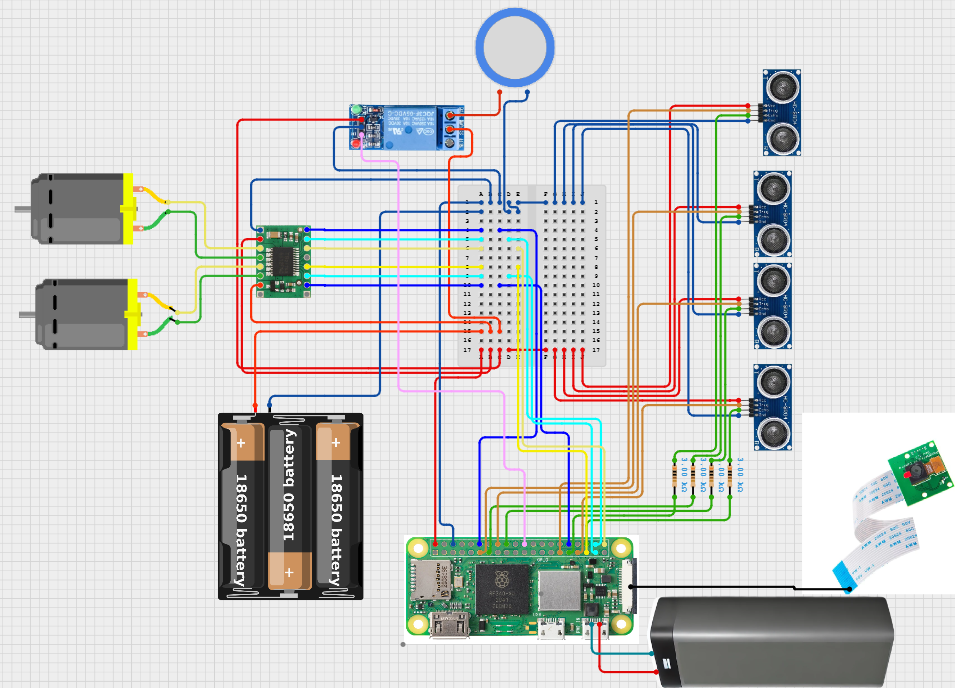

---

# Modelo 3D

Diseño 3D del chasis y componentes mecánicos del robot.

  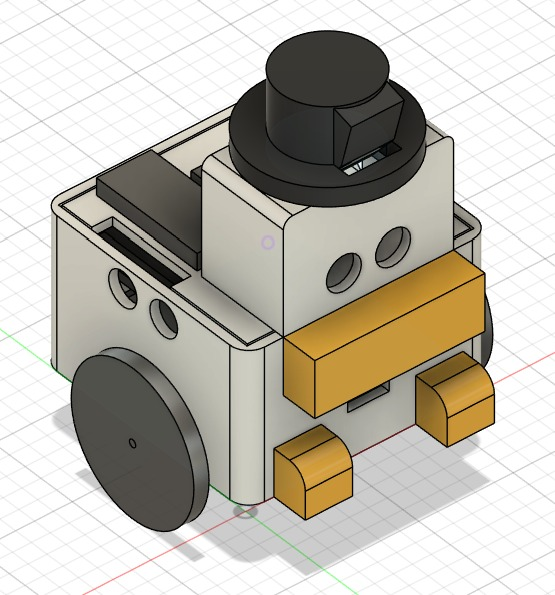

---

# Arquitectura Software

Diagrama general de la arquitectura software del proyecto.

  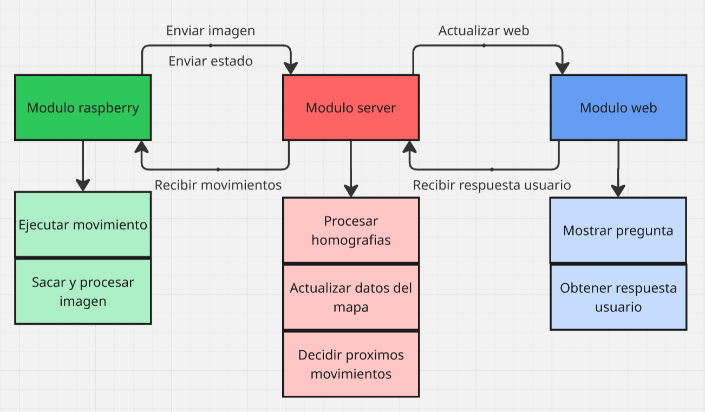

---

# Características

- Navegación autónoma en laberintos
- Reconocimiento visual mediante cámara
- Detección de llaves y puertas
- Interacción con el usuario mediante retos
- Arquitectura modular y escalable

---

# Referencias

- [@Rescue Maze Entry Presentation](https://www.youtube.com/watch?v=UpNFrBUcTxU&t=488s)
- [@The SECRET to Building a Maze Solving Robot](https://www.youtube.com/watch?v=Id-Xi8evfKU)
- [@Maze Navigating Robot Project With PicoBricks](https://picobricks.com/blogs/robotic-stem-projects/maze-solving-robot)
- [@Mec Robotics](https://www.micromice.org/)

---

# Autores

| Nombre | GitHub |
|---|---|
| Joan Aguilar Vilalta | [@JoanAV-H](https://github.com/JoanAV-H) |
| Gerard Benet Martinez | [@Gemarcx](https://github.com/Gemarcx) |
| Martí Barrio Galobardes | [@MBGit05](https://github.com/MBGit05) |
| Javier Emparan Lopez | [@Emparans](https://github.com/Emparans) |

---

# Agradecimientos

Queremos agradecer a nuestros 3 profesores de la asignatura por ayudarnos en el proceso de creación de nuestro proyecto:

- Fernando Luis Vilariño Freire
- Carlos García Calvo
- Vernon Stanley Albayeros Duarte

# URL acceso a la web

¡Prueba la interfaz del proyecto en tiempo real! 

**[Acceder a la Web del Proyecto (Demo)](http://34.0.201.131:8080)**

